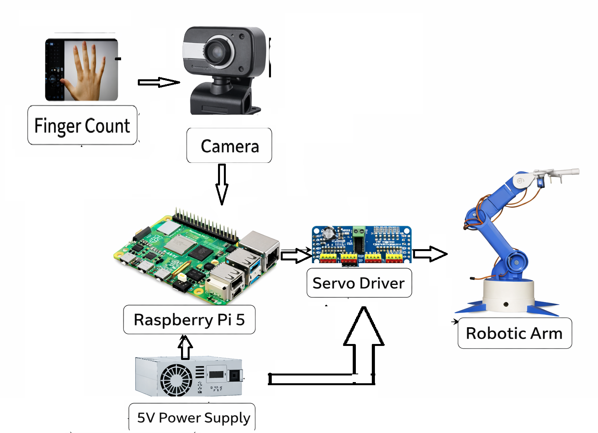

# 🤖 Gesture Controlled Robotic Arm using OpenCV & Raspberry Pi

---

## 📌 Overview
This project demonstrates a real-time **gesture-controlled robotic arm** using computer vision and embedded systems.

A webcam captures hand gestures, which are processed using **OpenCV** and **MediaPipe**. Based on detected finger patterns, control signals are generated and sent to **Raspberry Pi GPIO**, which drives servo motors to control a robotic arm.

---

## 🎯 Objectives
- Develop a real-time hand gesture recognition system
- Interface computer vision with embedded hardware
- Control robotic movement using intuitive gestures
- Build a scalable base for AI-driven robotic systems

---

## ⚙️ System Workflow

1. Webcam captures live video feed  
2. OpenCV processes each frame  
3. MediaPipe detects hand landmarks  
4. Finger counting logic identifies gesture  
5. Raspberry Pi processes gesture input  
6. PWM signals generated for servo motors  
7. Robotic arm performs corresponding action  

---

## 🧠 System Architecture

Camera → OpenCV → MediaPipe → Finger Detection → Raspberry Pi → Servo Driver → Robotic Arm

---

## 🧩 Block Diagram



---

## 🚀 Advanced Version

An enhanced version of this project includes **gesture labeling and smarter control logic**.

📁 Folder: `advanced_version/`

👉 Run:
```bash
python advanced_version/smart_gesture_control.py
✨ Enhancements
Gesture labeling (START, STOP, PICK, DROP)
Improved detection stability
Better user feedback via display
Scalable for multi-servo control
💻 Software Requirements
Python 3.10+
OpenCV (cv2)
MediaPipe
NumPy
RPi.GPIO (for Raspberry Pi)
📦 Install Dependencies
pip install -r requirements.txt
🔌 Hardware Requirements
Component	Specification
Raspberry Pi	Raspberry Pi 4 / 5
Camera	USB Webcam
Servo Motor	SG90 / MG90S
Servo Driver	PCA9685 (Recommended)
Power Supply	5V 2A (Pi) + External 5V for servos
Jumper Wires	Male-Female
🔧 Hardware Connections (PCA9685)
PCA9685 Pin	Raspberry Pi
VCC	5V
GND	GND
SDA	GPIO2
SCL	GPIO3

⚠️ Important:
Do NOT power servos directly from Raspberry Pi — use an external supply.

📂 Project Structure
gesture_detection/
   └── hand_tracking.py

servo_control/
   └── servo_driver.py

advanced_version/
   ├── smart_gesture_control.py
   └── README_advanced.md

main.py
requirements.txt
README.md
robo arm block github.png
▶️ How to Run
Step 1: Install Dependencies
pip install -r requirements.txt
Step 2: Run Gesture Detection
python gesture_detection/hand_tracking.py
Step 3: Run Servo Control (on Raspberry Pi)
python servo_control/servo_driver.py
🎮 Gesture Mapping
Fingers Detected	Action
0	Servo → 0°
1	Servo → 45°
2	Servo → 90°
3	Servo → 120°
4	Servo → 150°
5	Servo → 180°
⚠️ Challenges Faced
Servo jitter due to unstable power supply
MediaPipe compatibility with Python versions
Real-time processing latency
Calibration of gesture detection accuracy
🔮 Future Scope
Multi-DOF robotic arm control
Wireless control using WiFi/Bluetooth
AI-based gesture classification (ML/DL models)
Mobile app integration
Industrial automation applications
👨‍💻 Author

Gauri S Lohate
⭐ Acknowledgment
OpenCV Documentation
MediaPipe by Google
Raspberry Pi Community
